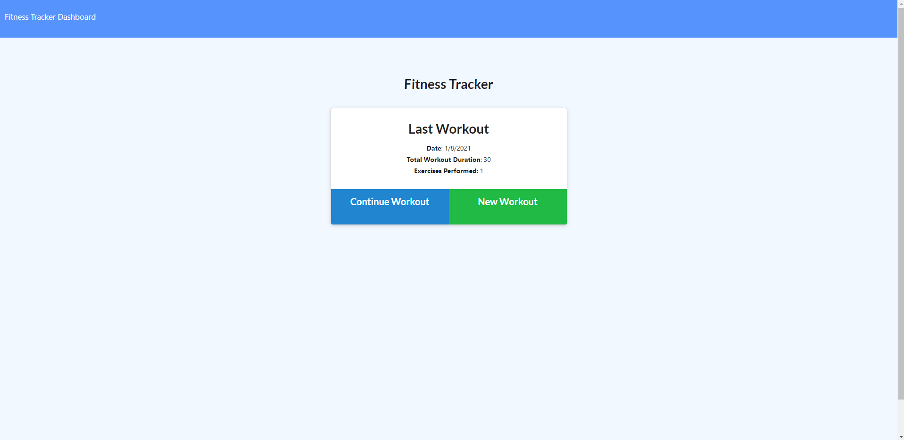
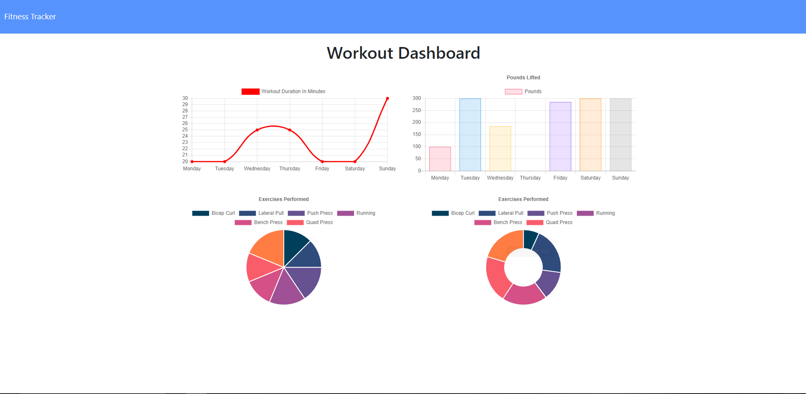

# Fitness Tracker
  
  # Table of Contents
1. [Description](#description)
2. [Installation](#installation)
3. [Usage](#usage)
4. [Screenshots](#sceenshots)
5. [Contributing](#contributing)
6. [Tests](#tests)
7. [License](#license)
8. [Questions](#questions)
## Description
* Manage and create workouts through web interface
## Installation
* Download .zip or clone repo and use terminal in root directory to install dependencies with `npm i`
## Usage
* `node server` to start the server then open your browser to http://localhost:3000 or visit the live deployment at https://warm-shelf-69323.herokuapp.com/ to view the page, add or continue workouts and view past data in the dashboard
## Screenshots
* 
* 
## Contributing
* accepting all forms of input/criticism
## Tests
* none provided
## License
* A short and simple permissive license with conditions only requiring preservation of copyright and license notices. Licensed works, modifications, and larger works may be distributed under different terms and without source code.
## Questions
* Contact me at:
  * [My GitHub Profile](https://github.com/johnwestermeyer)
  * My Email johnwestermeyer@gmail.com
